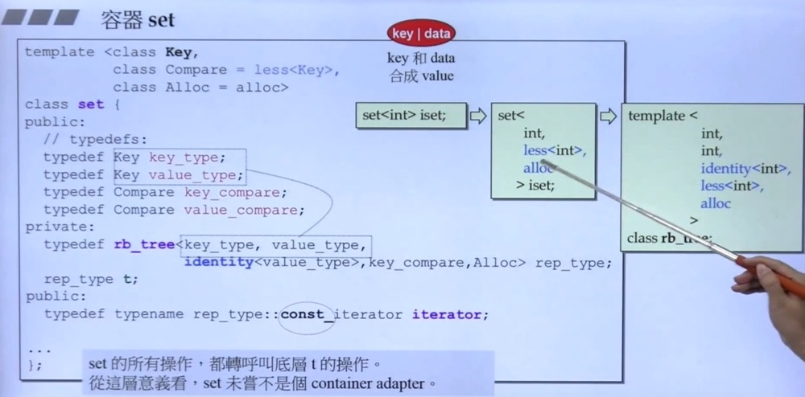
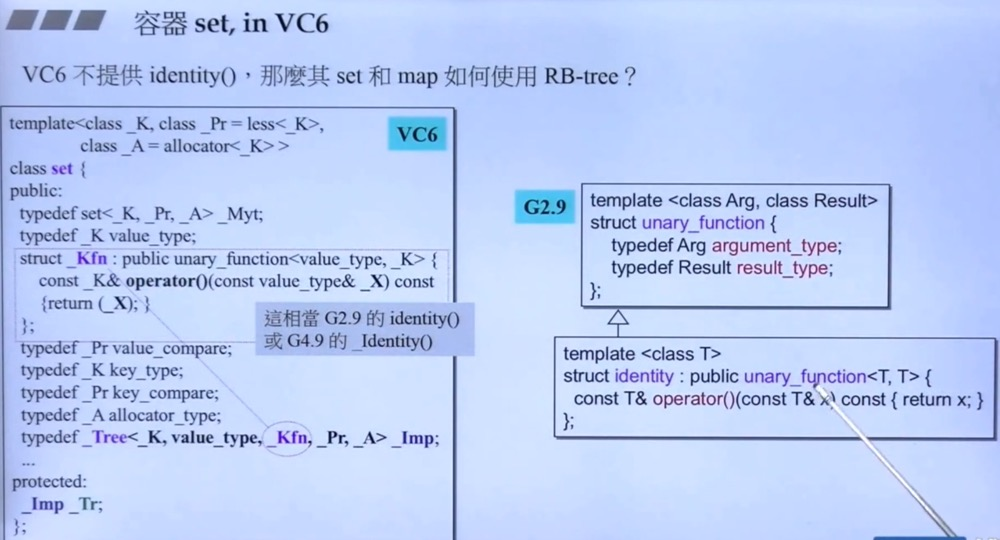

# 容器set,multiset

set/multiset以rb_tree为底层结构，因此有 ***元素自动排序*** 特性。排序的依据就是key，而 ***set/multiset元素的value和key合一： value就是key***。

set/multiset提供“遍历”操作以及iterators按正常规则（++ite）遍历，便能获得排序状态（sorted）。

我们 **无法** 使用set/multiset的iterators改变元素值（因为key有其严谨排列规则）。set/multiset的iterators是其底部的RBtree的const-iterator，就是为了 **禁止** user对元素赋值。

set元素的key必须独一无二，因此其insert()用的是rb_tree的 ***insert_unique()***;multiset元素的key可以重复，因此其insert()用的是rb_tree的 ***insert_equal()***。

## set

## set vc 6.0

