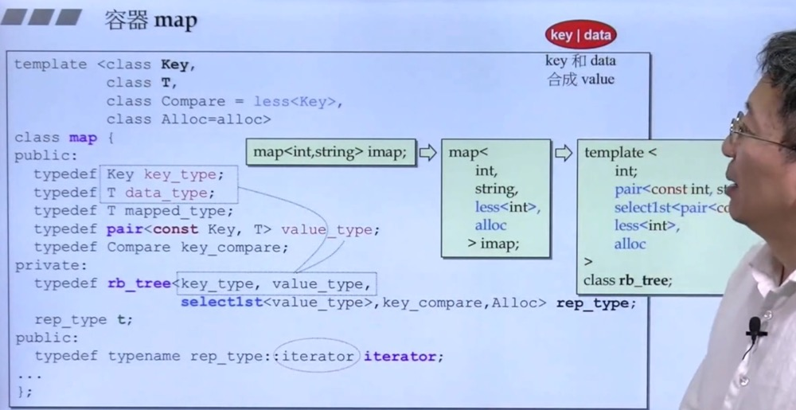

# 容器map，multimap

map/multimap以rb_tree为底层结构，因此有“元素自动排序”特性。排序依据是key。

map/multimap提供“遍历”操作及iteratros。按正常规则（++it）遍历，便能获得排序状态（sorted）。

我们 **无法** 使用map/multimap的iterators改变元素的key（因为key有其严谨排列规则），但可以用她来改变元素的data。因此map/multimap内部自动将 **user指定的key type** 设为const，如此便能 **禁止** user对元素的key赋值。

map元素的key必须独一无二，因此其insert()用的是rb_tree的 ***insert_unique()*** 。
multimap元素的key可以重复，因此其insert()用的是rb_tree的 ***insert_equal()*** 。

```c++
template <typename Key, typename T, ...>
class map {
    typedef pair<const Key, T> value_type;
    typedef rb_tree<key_type, value_type, ...> rep_type;
    rep_type t;
...    
};
```

## map


## map vc 6.0


## map []
![map-[]](./images/map%5B%5D.jpg)