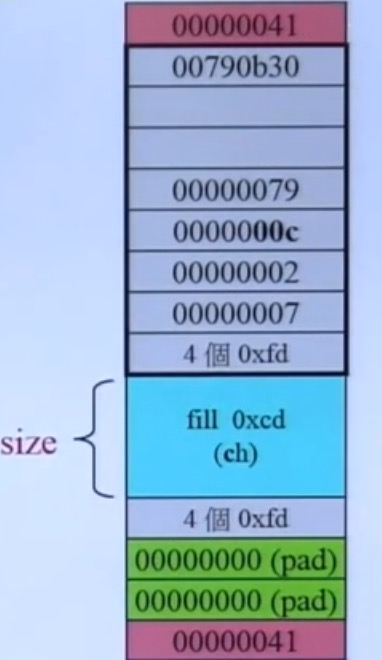
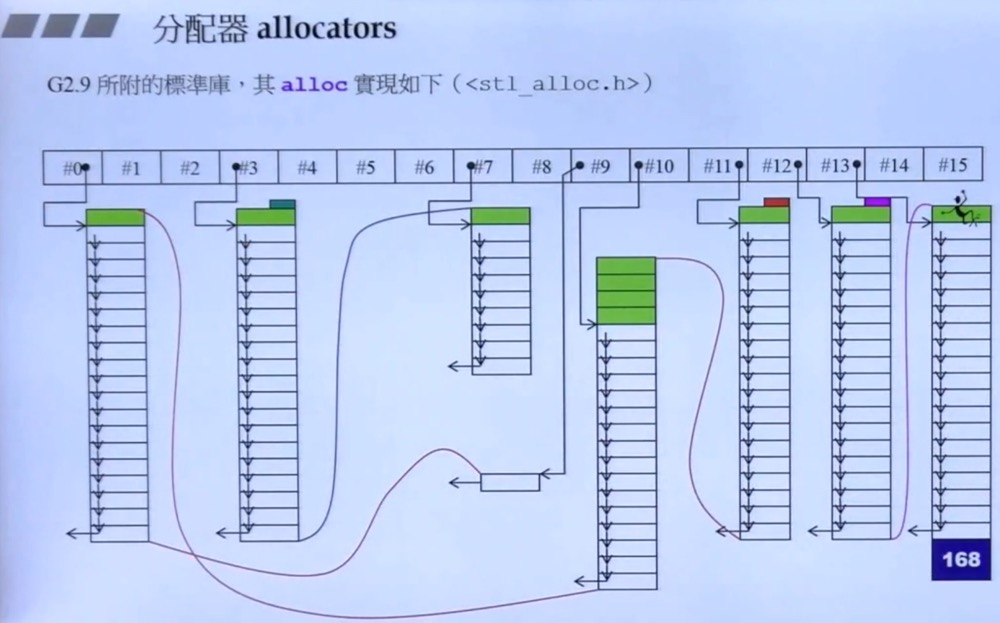

## 先谈 operator new() 和 malloc()

### malloc()分配的内存比申请的更多


vc6对allocator的使用
```c++
template <class _Ty, class _A = allocator<_Ty>>
class vector
{ //...
};
```
```c++
template <class _Ty>
class allocator {
public:
    typedef _SIZT size_type;            // #define _SIZT size_t
    typedef _PDFT difference_type;      // #define _PDFT ptrdiff_t
    typedef _Ty _FARQ *pointer;         // #define _FARQ
    typedef _Ty value_type;
    pointer allocator(size_type _N, const void *)
        { return (_Allocate((difference_type)_N, (pointer)0)); }
    void deallocate(void _FARQ *_P, size_type)
        { operator delete(_P); }
};
```
其中用到的_Allocate()定义如下：
```c++
template<typename _Ty>  inline
_Ty _FARQ *_Allocate(_PDFT _N, _Ty _FARQ *)
{ if (_N < 0) _N = 0;
  return ((_Ty_FARQ *)operator new((_SIZT)_N * sizeof (_Ty))); }
```
VC6+的allocator只是以::operator new 和 ::operator delete 完成allocate() 和 deallocate(), 没有任何特殊设计。
```c++
int* p = allocator<int>().allocate(512, (int*)0);
allocator<int>().deallocate(p, 512);
```

